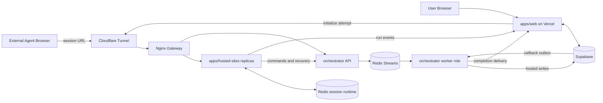

# AgentBench

> [中文](./README.zh-CN.md) | English

AgentBench is an interactive benchmark platform for observing and scoring tool-using AI agents. It provides hosted, session-scoped web tasks, live run telemetry, replay, and deterministic server-side evaluation.

## Core Features

- hosted-web benchmark suites for external agents
- live run and tool-event observability
- session-scoped task state backed by Redis
- deterministic per-task and aggregate scoring
- horizontally scalable hosted-sites runtime
- partitioned Redis Streams command processing
- isolated development and production deployment paths
- self-hosted Linux deployment through Docker and GitHub Actions

## Quick Start

Requirements: Node.js, pnpm, Docker, and a configured Supabase project.

```bash
pnpm install
cp apps/web/.env.example apps/web/.env.local
cp .env.docker.example .env
docker-compose up -d --build
pnpm dev:web
```

Default local endpoints:

- Web: `http://localhost:3000`
- Hosted gateway: `http://localhost:8080`
- Health check: `http://localhost:8080/health`

See [Getting Started](./docs/getting-started.md) for environment setup and development workflows.

## Verification

`pnpm install` configures the repository pre-push hook automatically. Repair or install it manually when needed:

```bash
pnpm hooks:install
```

The hook runs `pnpm verify:ci`, the same coverage-gated tests, local service smoke, deployment classifier tests, and production builds used by GitHub Actions. The database-backed lifecycle smoke remains explicit because it creates Supabase run data:

```bash
pnpm smoke:lifecycle
```

## System Boundary



## Repository Layout

```text
apps/
  web/                  Next.js control plane and live UI
  hosted-sites/         hosted benchmark applications
  hosted-orchestrator/  attempt lifecycle and suite orchestration
packages/
  protocol/             shared protocol contracts
  scoring/              evaluator and aggregation logic
  shared/               shared application and database types
  test-cases/           benchmark definitions and fixtures
infra/                  Docker, Nginx, and deployment scripts
supabase/               database migrations
docs/                   architecture and operational documentation
```

## Documentation

- [Contributing](./CONTRIBUTING.md)
- [Security Policy](./SECURITY.md)
- [Code of Conduct](./CODE_OF_CONDUCT.md)
- [Documentation Index](./docs/README.md)
- [Getting Started](./docs/getting-started.md)
- [Architecture](./docs/architecture.md)
- [Data Ownership](./docs/data-ownership.md)
- [Consistency and Failure](./docs/consistency-and-failure.md)
- [Hosted Web Benchmarks](./docs/hosted-web-benchmark.md)
- [Hosted Site App Authoring](./docs/hosted-site-app-authoring.md)
- [Deployment and Scaling](./docs/deployment.md)
- [Benchmark Specification](./docs/benchmark-spec.md)
- [API Reference](./docs/api-reference.md)
- [Data Model](./docs/data-model.md)
- [Data Flow](./docs/data-flow.md)
- [Security](./docs/security.md)
- [Roadmap](./docs/roadmap.md)

## License

AgentBench is source-available under the [PolyForm Noncommercial License 1.0.0](./LICENSE). Noncommercial use is permitted under its terms. Commercial use requires a separate license from the copyright holder.

This is not an OSI-approved open-source license.
