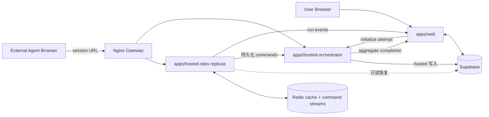

# AgentBench

> [English](./README.md) | 中文

AgentBench 是一个用于观察和评测工具型 AI Agent 的交互式基准平台，提供会话隔离的托管 Web 任务、实时运行事件、回放和确定性的服务端评分。

## 核心能力

- 面向外部 Agent 的托管 Web 基准套件
- 实时运行和工具事件可观测性
- 基于 Redis 的会话级任务状态
- 确定性的单任务评分与聚合评分
- 支持横向扩容的 hosted-sites 运行时
- 基于 Docker 和 GitHub Actions 的私有 Linux 部署

## 快速开始

需要安装 Node.js、pnpm、Docker，并准备一个 Supabase 项目。

```bash
pnpm install
cp apps/web/.env.example apps/web/.env.local
cp .env.docker.example .env
docker-compose up -d --build
pnpm dev:web
```

默认本地地址：

- Web：`http://localhost:3000`
- 托管网关：`http://localhost:8080`
- 健康检查：`http://localhost:8080/health`

环境配置和开发方式参见[快速上手](./docs/getting-started.zh-CN.md)。

## 验证

`pnpm install` 会自动配置仓库的 pre-push hook。需要修复或手动安装时执行：

```bash
pnpm hooks:install
```

hook 会执行 `pnpm verify:ci`，与 GitHub Actions 共用覆盖率门槛测试、本地服务 smoke、部署分类测试和生产构建。数据库生命周期 smoke 会创建 Supabase run 数据，因此保持显式执行：

```bash
pnpm smoke:lifecycle
```

## 系统边界



## 仓库结构

```text
apps/
  web/                  Next.js 控制面和实时界面
  hosted-sites/         托管基准应用
  hosted-orchestrator/  attempt 生命周期与套件编排
packages/
  protocol/             共享协议契约
  scoring/              评测器和聚合逻辑
  shared/               共享应用及数据库类型
  test-cases/           基准定义和 fixtures
infra/                  Docker、Nginx 和部署脚本
supabase/               数据库 migrations
docs/                   架构和运维文档
```

## 文档

- [贡献指南](./CONTRIBUTING.md)
- [安全报告策略](./SECURITY.md)
- [行为准则](./CODE_OF_CONDUCT.md)
- [文档索引](./docs/README.zh-CN.md)
- [快速上手](./docs/getting-started.zh-CN.md)
- [架构](./docs/architecture.zh-CN.md)
- [托管 Web 基准](./docs/hosted-web-benchmark.zh-CN.md)
- [托管站点应用开发](./docs/hosted-site-app-authoring.zh-CN.md)
- [部署与扩容](./docs/deployment.zh-CN.md)
- [基准规范](./docs/benchmark-spec.zh-CN.md)
- [API 参考](./docs/api-reference.zh-CN.md)
- [数据模型](./docs/data-model.zh-CN.md)
- [数据流](./docs/data-flow.zh-CN.md)
- [安全](./docs/security.zh-CN.md)
- [Orchestrator 职责优化 TODO](./docs/orchestrator-todo.zh-CN.md)

## 许可证

AgentBench 以 [PolyForm Noncommercial License 1.0.0](./LICENSE) 作为源码可见许可证。符合协议条款的非商业使用获得许可；商业使用必须另行取得版权所有者授权。

该许可证不是 OSI 认可的开源许可证。
