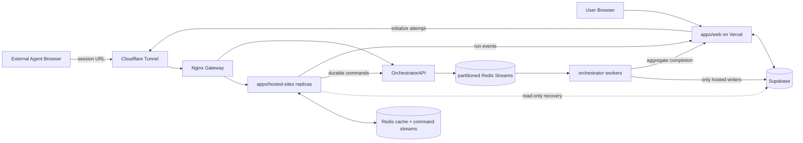

# Architecture

> [中文](./architecture.zh-CN.md) | English

## System Boundary

AgentBench is a hosted-web benchmark platform. The evaluated agent owns its browser. AgentBench owns run creation, benchmark websites, session state, telemetry, and scoring.

## Components

### `apps/web`

- creates and reads benchmark runs
- enforces guest/user quotas
- allocates hosted attempts through the orchestrator
- receives internal run events and final completion
- serves live SSE snapshots, artifacts, and replay UI

### `apps/hosted-sites`

- serves `shopping-lite`, `forum-lite`, `repo-lite`, and `wiki-lite`
- validates session tokens and app ownership
- mutates session-scoped task state
- emits telemetry and task signals
- evaluates individual sessions
- delegates lifecycle progression and aggregate completion to the orchestrator

The service is stateless at the process boundary. Its local map is only a hot copy; Redis is the shared runtime cache across replicas, and Supabase is a read-only recovery fallback. Durable hosted writes are sent to the orchestrator.

### `apps/hosted-orchestrator`

- initializes attempts and ordered sessions
- owns the active-session pointer
- validates completion order
- promotes the next session
- persists per-session and aggregate score state
- is the only writer for `benchmark_attempts`, `hosted_web_sessions`, and `hosted_web_results`
- persists hosted session snapshots, access records, and events received as authenticated commands
- handles timeout and cleanup sweeps
- forwards terminal run completion to `apps/web`

The same image supports `ORCHESTRATOR_MODE=api|worker|all`. The API role authenticates, validates, routes commands to a stable partition, and serves read models. The worker role consumes owned partitions and performs durable writes.

The deployment profile matters:

- local `docker-compose.yml` runs one API process and two workers covering partitions `0-7` and `8-15`
- server Compose uses the same role split: one API process and two workers with disjoint partition ownership
- API replicas may scale independently; worker services must not be scaled without redistributing partitions because duplicate leases are rejected
- deployment validates static partition coverage before startup and requires all 16 dynamic leases before readiness succeeds

### Redis

Redis has two isolated responsibilities. Versioned session keys provide the shared runtime cache used by hosted-sites replicas. Sixteen partitioned Streams form the orchestrator command backbone. Stable entity hashing preserves order for one attempt/session while disjoint workers process partitions concurrently. Redis leases prevent overlapping worker ownership.

### Supabase

Supabase stores durable control-plane and audit data: runs, attempts, hosted sessions, events, results, aggregate scores, access logs, and artifacts. It stores app state snapshots in session metadata for recovery, but it is not the primary per-request state store.

### Nginx and Cloudflare

Nginx is the only gateway inside the hosted Compose network. It load-balances hosted-sites replicas and routes the orchestrator prefix to the orchestrator service. Cloudflare Tunnel publishes the environment-specific hosted hostname and forwards it to the corresponding host gateway port; TLS terminates at the Cloudflare edge.

## Deployment Boundaries

| Environment | Source branch | Web | Hosted Compose project | Gateway port | Database target |
| --- | --- | --- | --- | --- | --- |
| Development | `develop` | Vercel test project | `agentbench-development` | `8081` | development Supabase branch/database |
| Production | `main` | Vercel production project | `agentbench-production` | `8080` | production Supabase database |

GitHub `development` and `production` Environments hold separate variables and secrets. Hosted deployments run on separately labelled self-hosted runners. Database migrations must succeed before the matching Compose deployment starts. Pull requests to `main` are accepted only from `develop` or `hotfix/*` by the required CI check.

## Ownership Rules

| Concern | Owner |
| --- | --- |
| User identity, quota, run UI | `apps/web` |
| Attempt lifecycle and ordered progression | `apps/hosted-orchestrator` |
| Task UI and app-state mutation | `apps/hosted-sites` |
| Shared mutable session state | Redis |
| Durable command ingest and worker coordination | Redis Streams |
| Durable hosted writes | `apps/hosted-orchestrator` |
| Durable records and audit history | Supabase |
| Per-session evaluation functions | hosted app definitions / `packages/scoring` |
| Public hosted edge and TLS | Cloudflare Tunnel |
| Hosted service routing | Nginx |

## Failure Model

- A hosted-sites replica may disappear between requests; Redis allows another replica to continue.
- Redis failure degrades session availability; hosted-sites can recover persisted app state through read-only Supabase access.
- Orchestrator failure prevents attempt progression and aggregate completion, but hosted task pages can still render from Redis.
- Web callback failure delays live observability or final run completion; persisted hosted results remain available for reconciliation.
- Cloudflare Tunnel or Nginx failure makes hosted URLs unavailable without changing durable run state.

Detailed contracts are documented in [API Reference](./api-reference.md), [Data Model](./data-model.md), and [Data Flow](./data-flow.md).
