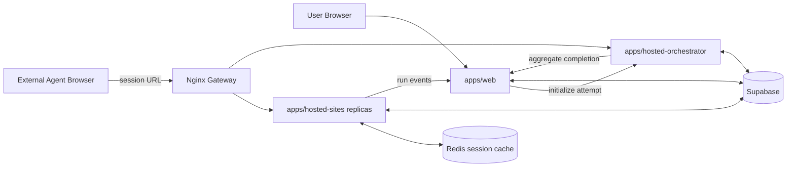

# Architecture

> [中文](./architecture.zh-CN.md) | English

## System Boundary

AgentBench is a hosted-web benchmark platform. The evaluated agent owns its browser. AgentBench owns run creation, benchmark websites, session state, telemetry, and scoring.

## Components

### `apps/web`

- creates and reads benchmark runs
- enforces guest/user quotas
- allocates hosted attempts through the orchestrator
- receives internal run events and final completion
- serves live SSE snapshots, artifacts, and replay UI

### `apps/hosted-sites`

- serves `shopping-lite`, `forum-lite`, `repo-lite`, and `wiki-lite`
- validates session tokens and app ownership
- mutates session-scoped task state
- emits telemetry and task signals
- evaluates individual sessions
- delegates lifecycle progression and aggregate completion to the orchestrator

The service is stateless at the process boundary. Its local map is only a hot copy; Redis is the shared runtime source across replicas, and Supabase is the durable fallback.

### `apps/hosted-orchestrator`

- initializes attempts and ordered sessions
- owns the active-session pointer
- validates completion order
- promotes the next session
- persists per-session and aggregate score state
- handles timeout and cleanup sweeps
- forwards terminal run completion to `apps/web`

See [Orchestrator Responsibilities TODO](./orchestrator-todo.md) for the planned boundary cleanup.

### Redis

Redis stores the complete mutable hosted session as a versioned JSON envelope. It enables any hosted-sites replica to serve the next request without depending on process-local memory or a Supabase read.

### Supabase

Supabase stores durable control-plane and audit data: runs, attempts, hosted sessions, events, results, aggregate scores, access logs, and artifacts. It stores app state snapshots in session metadata for recovery, but it is not the primary per-request state store.

### Nginx

Nginx is the only gateway. It load-balances hosted-sites replicas and routes the orchestrator prefix to the orchestrator service.

## Ownership Rules

| Concern | Owner |
| --- | --- |
| User identity, quota, run UI | `apps/web` |
| Attempt lifecycle and ordered progression | `apps/hosted-orchestrator` |
| Task UI and app-state mutation | `apps/hosted-sites` |
| Shared mutable session state | Redis |
| Durable records and audit history | Supabase |
| Per-session evaluation functions | hosted app definitions / `packages/scoring` |
| Public traffic routing | Nginx |

## Failure Model

- A hosted-sites replica may disappear between requests; Redis allows another replica to continue.
- Redis failure degrades session availability; Supabase recovery is possible for persisted app state but may not contain transient events.
- Orchestrator failure prevents attempt progression and aggregate completion, but hosted task pages can still render from Redis.
- Web callback failure delays live observability or final run completion; persisted hosted results remain available for reconciliation.

Detailed contracts are documented in [API Reference](./api-reference.md), [Data Model](./data-model.md), and [Data Flow](./data-flow.md).
