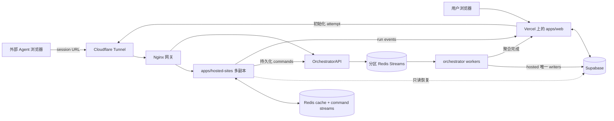

# 架构

> [English](./architecture.md) | 中文

## 系统边界

AgentBench 是托管 Web 基准平台。被评测 Agent 自己控制浏览器；AgentBench 负责创建 run、托管基准网站、保存 session 状态、采集事件和评分。

## 组件

### `apps/web`

- 创建和读取 benchmark run
- 执行游客与登录用户配额
- 通过 orchestrator 分配 hosted attempt
- 接收内部 run event 和最终完成回调
- 提供实时 SSE snapshot、artifact 和回放界面

### `apps/hosted-sites`

- 提供 `shopping-lite`、`forum-lite`、`repo-lite` 和 `wiki-lite`
- 校验 session token 与 app 归属
- 修改 session 隔离的业务状态
- 发出 telemetry 和 task signal
- 对单个 session 评分
- 将生命周期推进和聚合完成委托给 orchestrator

该服务在进程边界上无状态。本地 Map 只是热副本；Redis 是多副本共享运行时缓存，Supabase 只用于只读恢复。所有 hosted 持久化写入都发送给 orchestrator。

### `apps/hosted-orchestrator`

- 初始化 attempt 和有序 sessions
- 维护 active session 指针
- 校验完成顺序
- 激活下一个 session
- 持久化单 session 与聚合评分
- 是 `benchmark_attempts`、`hosted_web_sessions` 和 `hosted_web_results` 的唯一 writer
- 接收鉴权 command，持久化 session snapshot、访问记录和事件
- 处理 timeout 和 cleanup sweep
- 将终态 run completion 转发给 `apps/web`

同一镜像支持 `ORCHESTRATOR_MODE=api|worker|all`。API 角色负责鉴权、校验、稳定分区路由和 read model；worker 角色消费自己拥有的 partitions 并执行持久化写入。

部署 profile 会影响实际进程边界：

- 本地 `docker-compose.yml` 运行一个 API 进程和两个 workers，分别负责 partition `0-7` 与 `8-15`
- 服务器 Compose 使用相同的角色拆分：一个 API 进程和两个拥有互斥 partition 的 workers
- API 副本可以独立扩容；worker service 在重新分配 partition 前不能直接扩容，因为重复 lease 会被拒绝
- 部署在启动前校验静态 partition 覆盖，并要求 16 个动态 lease 全部就绪后才通过 readiness

### Redis

Redis 有两个隔离的职责。带版本号的 session key 是 hosted-sites 多副本共享的运行时缓存；16 个分区 Stream 构成 orchestrator command backbone。稳定实体 hash 保证同一 attempt/session 的顺序，互不重叠的 workers 可并行消费不同 partition；Redis lease 防止 partition 重复归属。

### Supabase

Supabase 保存持久控制面与审计数据：runs、attempts、hosted sessions、events、results、聚合分数、访问日志和 artifacts。session metadata 中保存 app state snapshot 用于恢复，但它不是每次请求的主要状态源。

### Nginx 与 Cloudflare

Nginx 是 hosted Compose 网络内的唯一网关，负责负载均衡 hosted-sites 副本，并将 orchestrator 前缀路由到 orchestrator 服务。Cloudflare Tunnel 发布各环境独立的 hosted hostname，并转发到对应宿主机 gateway 端口；TLS 在 Cloudflare edge 终止。

## 部署边界

| 环境 | 来源分支 | Web | Hosted Compose project | Gateway 端口 | 数据库目标 |
| --- | --- | --- | --- | --- | --- |
| Development | `develop` | Vercel test project | `agentbench-development` | `8081` | development Supabase branch/database |
| Production | `main` | Vercel production project | `agentbench-production` | `8080` | production Supabase database |

GitHub `development` 和 `production` Environments 保存独立 variables 与 secrets。Hosted 部署使用标签隔离的 self-hosted runners；数据库 migration 必须成功后，对应 Compose 才能部署。Required CI 只允许 `develop` 或 `hotfix/*` 的 PR 合入 `main`。

## 职责归属

| 关注点 | 负责人 |
| --- | --- |
| 用户身份、配额、run UI | `apps/web` |
| Attempt 生命周期和顺序推进 | `apps/hosted-orchestrator` |
| 任务 UI 与 app state 修改 | `apps/hosted-sites` |
| 共享可变 session 状态 | Redis |
| 持久化 command ingest 与 worker 协调 | Redis Streams |
| Hosted 持久化写入 | `apps/hosted-orchestrator` |
| 持久记录和审计历史 | Supabase |
| 单 session 评测函数 | hosted app definitions / `packages/scoring` |
| Hosted 公网 edge 与 TLS | Cloudflare Tunnel |
| Hosted 服务路由 | Nginx |

## 故障模型

- hosted-sites 副本可在请求间消失，其他副本通过 Redis 继续处理。
- Redis 故障会影响 session 可用性；hosted-sites 可通过只读 Supabase 访问恢复已持久化 app state。
- orchestrator 故障会阻止 attempt 推进和聚合完成，但 Redis 中的任务页面仍可读取。
- Web 回调故障会延迟实时展示或 run 终态更新；已持久化 hosted result 可用于后续对账。
- Cloudflare Tunnel 或 Nginx 故障会使 hosted URL 不可用，但不会修改持久 run 状态。

详细契约参见 [API 参考](./api-reference.zh-CN.md)、[数据模型](./data-model.zh-CN.md)和[数据流](./data-flow.zh-CN.md)。
