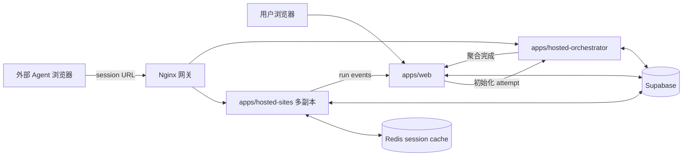

# 架构

> [English](./architecture.md) | 中文

## 系统边界

AgentBench 是托管 Web 基准平台。被评测 Agent 自己控制浏览器；AgentBench 负责创建 run、托管基准网站、保存 session 状态、采集事件和评分。

## 组件

### `apps/web`

- 创建和读取 benchmark run
- 执行游客与登录用户配额
- 通过 orchestrator 分配 hosted attempt
- 接收内部 run event 和最终完成回调
- 提供实时 SSE snapshot、artifact 和回放界面

### `apps/hosted-sites`

- 提供 `shopping-lite`、`forum-lite`、`repo-lite` 和 `wiki-lite`
- 校验 session token 与 app 归属
- 修改 session 隔离的业务状态
- 发出 telemetry 和 task signal
- 对单个 session 评分
- 将生命周期推进和聚合完成委托给 orchestrator

该服务在进程边界上无状态。本地 Map 只是热副本；Redis 是多副本共享运行态，Supabase 是持久化恢复来源。

### `apps/hosted-orchestrator`

- 初始化 attempt 和有序 sessions
- 维护 active session 指针
- 校验完成顺序
- 激活下一个 session
- 持久化单 session 与聚合评分
- 处理 timeout 和 cleanup sweep
- 将终态 run completion 转发给 `apps/web`

职责优化计划参见 [Orchestrator 职责 TODO](./orchestrator-todo.zh-CN.md)。

### Redis

Redis 以带版本号的 JSON envelope 保存完整可变 hosted session，使任意 hosted-sites 副本可以继续处理请求，不依赖进程内存或每次读取 Supabase。

### Supabase

Supabase 保存持久控制面与审计数据：runs、attempts、hosted sessions、events、results、聚合分数、访问日志和 artifacts。session metadata 中保存 app state snapshot 用于恢复，但它不是每次请求的主要状态源。

### Nginx

Nginx 是唯一网关，负责负载均衡 hosted-sites 副本，并将 orchestrator 前缀路由到 orchestrator 服务。

## 职责归属

| 关注点 | 负责人 |
| --- | --- |
| 用户身份、配额、run UI | `apps/web` |
| Attempt 生命周期和顺序推进 | `apps/hosted-orchestrator` |
| 任务 UI 与 app state 修改 | `apps/hosted-sites` |
| 共享可变 session 状态 | Redis |
| 持久记录和审计历史 | Supabase |
| 单 session 评测函数 | hosted app definitions / `packages/scoring` |
| 公网流量路由 | Nginx |

## 故障模型

- hosted-sites 副本可在请求间消失，其他副本通过 Redis 继续处理。
- Redis 故障会影响 session 可用性；持久化 app state 可从 Supabase 恢复，但瞬时事件可能不完整。
- orchestrator 故障会阻止 attempt 推进和聚合完成，但 Redis 中的任务页面仍可读取。
- Web 回调故障会延迟实时展示或 run 终态更新；已持久化 hosted result 可用于后续对账。

详细契约参见 [API 参考](./api-reference.zh-CN.md)、[数据模型](./data-model.zh-CN.md)和[数据流](./data-flow.zh-CN.md)。
