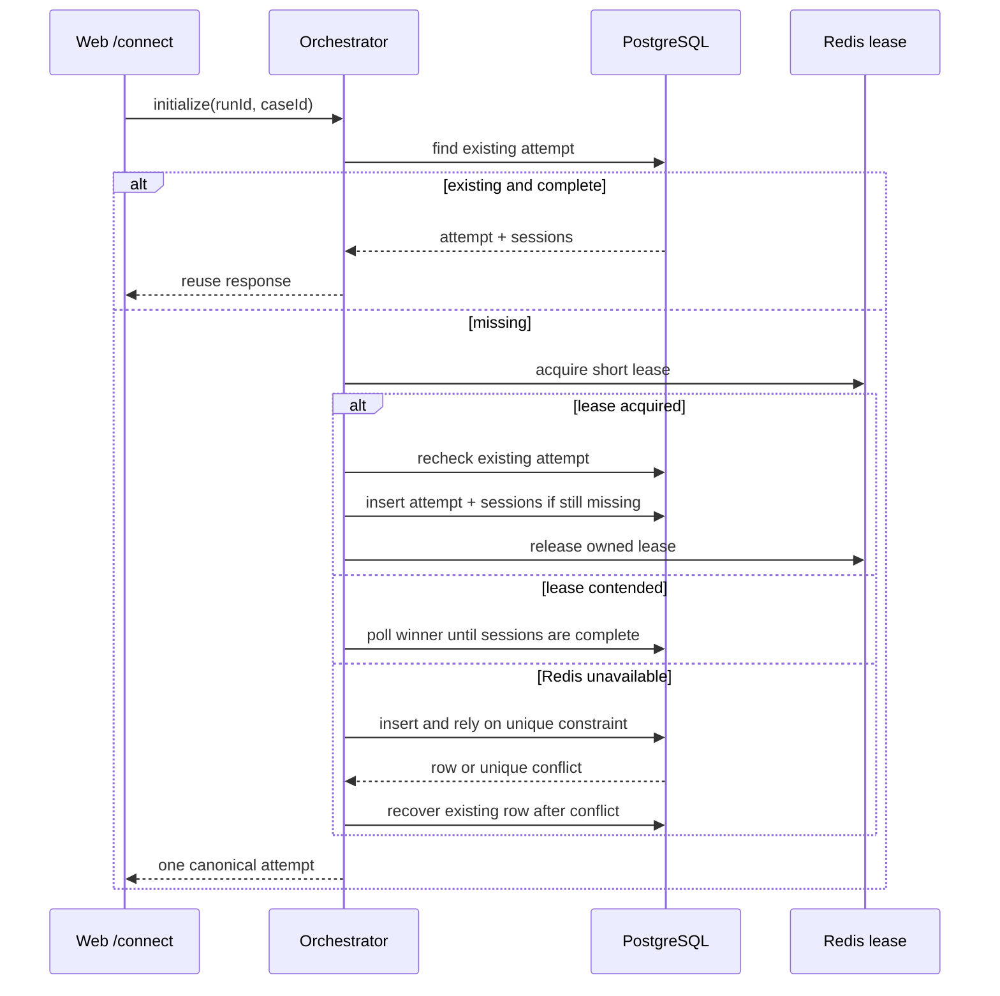

# Hosted Attempt Consistency

## Consistency Baseline

PostgreSQL is the source of truth for attempt and session lifecycle state. Redis is not an attempt registry and does not decide which attempt is canonical; it provides a short lease that reduces concurrent writes by orchestrator replicas.

Database invariants:

- Hosted-web permits one `benchmark_attempts` row per `(run_id, case_id, provider)`.
- Every hosted session references that attempt.
- A uniqueness conflict is an idempotent hit. The caller reloads the existing attempt instead of returning another session set.

## Initialization Protocol

## Failure Handling

- Redis connection failure: warn and continue with database-first initialization.
- Lease owner failure: wait for lease TTL; later requests still query PostgreSQL first.
- Attempt exists but sessions are incomplete: briefly poll the recovery path; never create a second attempt.
- Required migration missing: fail deployment before starting the new application version. Redis must not hide schema drift.

## Required Tests

- Existing attempts bypass Redis and inserts.
- Acquiring a lease is followed by another database lookup.
- Lease contenders wait for and reuse the winner.
- Redis outages recover idempotently through the unique database constraint.
- Repeated `/connect` calls produce one attempt, four unique sessions, and four `hosted.session.created` events.

The API writes `attempt.init` to a partitioned Redis Stream. A worker owning that partition performs database initialization. API and worker roles may be separate processes or combined locally, but both profiles use the same database-first protocol.
