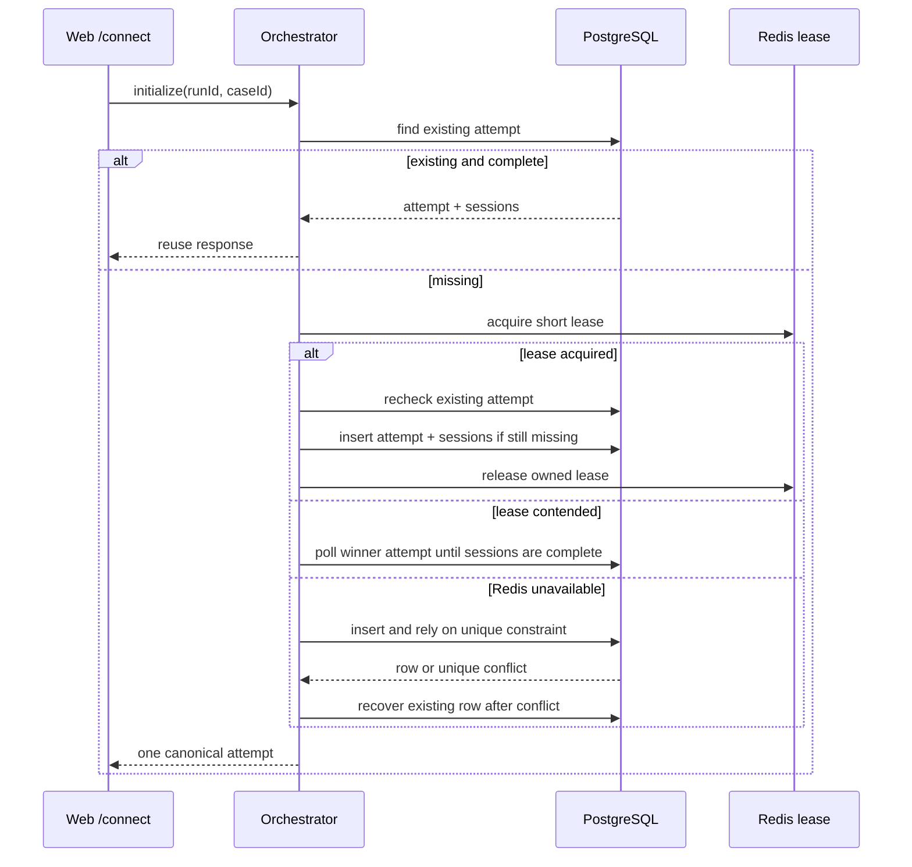

# Hosted Attempt 一致性

## 一致性基准

PostgreSQL 是 attempt/session 生命周期的唯一真相源。Redis 不是 attempt registry，也不决定哪个 attempt 有效；它只提供短期 lease，降低多个 orchestrator replica 同时写入的概率。

数据库约束：

- hosted-web 对同一 `(run_id, case_id, provider)` 只允许一个 `benchmark_attempts` row。
- session 必须引用该 attempt。
- 唯一冲突视为幂等命中，调用方应重新读取已有 attempt，而不是返回第二套 session。

## 初始化协议

## 失败处理

- Redis 连接失败：记录告警，继续 DB-first 初始化。
- lease owner 失败：lease TTL 到期；后续请求仍先查 DB。
- attempt 已写入但 sessions 尚未完成：恢复路径短暂轮询，不能创建第二个 attempt。
- DB migration 缺失：部署必须在启动新应用版本前失败，不能依赖 Redis 掩盖 schema 漂移。

## 必测场景

- 已存在 attempt 时不访问 Redis、不执行 insert。
- 获取 lease 后必须再次查 DB。
- 其他 replica 持有 lease 时等待并复用 winner。
- Redis 不可用时依赖数据库唯一约束完成幂等恢复。
- 同一 run 的重复 `/connect` 最终只有一个 attempt、四个唯一 session 和四个 `hosted.session.created` 事件。

API 入口将 `attempt.init` 写入分区 Redis Stream，并等待拥有该 partition 的 worker 角色执行数据库初始化。角色可以由独立 API/worker 进程承担，也可以像当前服务器 Compose 一样共置在一个 `ORCHESTRATOR_MODE=all` 进程中；两种 profile 都遵守相同的 DB-first 幂等协议。
