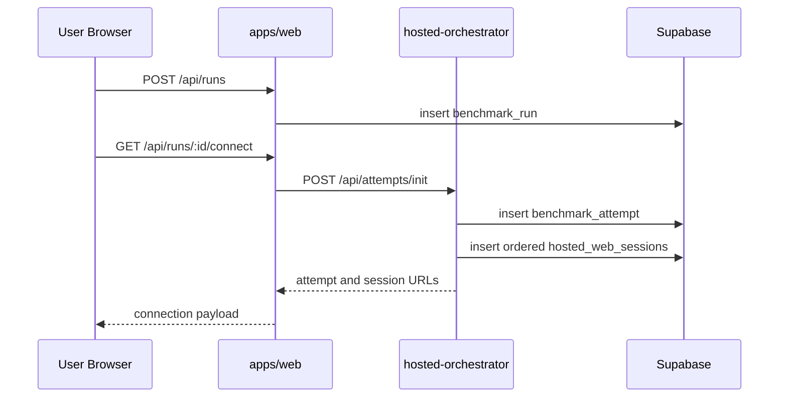
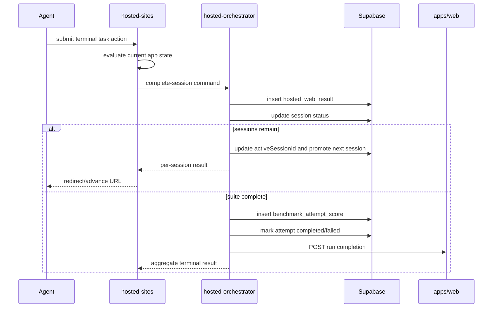

# Data Flow

> [中文](./data-flow.zh-CN.md) | English

## 1. Run Creation and Attempt Allocation

The first session is `active`; later sessions are `created`. Raw session tokens are returned to the client but only token hashes are stored durably.

## 2. Task Request Across Replicas

```mermaid
flowchart LR
  Request["Agent request with session token"] --> Nginx
  Nginx --> Replica["Any hosted-sites replica"]
  Replica --> Redis{"Redis hit?"}
  Redis -->|"yes"| Handle["Validate app and handle route"]
  Redis -->|"no/error"| Local{"Local Map hit?"}
  Local -->|"yes"| Handle
  Local -->|"no"| Supabase["Load durable session + appState snapshot"]
  Supabase --> Handle
  Handle --> Save["Write Redis runtime cache"]
  Save --> Command["Send snapshot/access/event command"]
  Command --> API["orchestrator API"]
  API -->|"hash attempt/session key"| Stream[("Redis stream partition")]
  Stream --> Worker["partition owner worker"]
  Worker --> SupabaseWrite["Persist durable hosted records"]
```

The shared Redis lookup is what makes horizontal scaling safe. A load balancer does not require sticky sessions.

## 3. Task Mutation and Telemetry

1. The route validates that the token's `session.app` matches the app route.
2. An app action mutates only `session.state` for that app.
3. hosted-sites writes the updated V2 envelope to Redis.
4. If the session is persisted, hosted-sites sends snapshot, access, and event commands to the orchestrator.
5. The orchestrator writes `hosted_web_sessions`, hosted events/access logs, and result state; hosted-sites does not write these tables directly.
6. hosted-sites forwards a normalized run event to `apps/web`.
7. The Web live page receives the next SSE snapshot containing run, events, and artifacts.

## 4. Session Completion and Suite Progression

Required-session failure forces the aggregate suite result to fail. Optional evaluators or sessions can contribute evidence without blocking a pass, according to scoring configuration.

## 5. Advance Resolution

`GET /api/attempts/:id/advance?session=...` reaches hosted-sites, which calls the orchestrator `resolve-advance` command. The orchestrator verifies that the current session belongs to the attempt and returns either:

- `complete: true` with no next URL, or
- the next session ID and tokenized start URL.

The client does not calculate ordering from URLs or local state.

## 6. Expiry and Timeout

When hosted-sites observes an expired session, it marks the session expired, evicts cache state, and sends a timeout command. The orchestrator marks the attempt `timeout`, invalidates remaining active/created sessions, and forwards terminal completion to the Web API.

A periodic orchestrator sweep also finds expired sessions and prunes access logs beyond the configured retention period.

## 7. Recovery and Consistency

- Redis write failures are logged; the in-process object may continue serving the current request but cross-replica continuity is at risk.
- Orchestrator command failures do not immediately break active Redis-backed sessions, but reduce recovery durability and audit completeness.
- Completion is designed to be idempotent: duplicate terminal commands return the latest result.
- There is no distributed transaction spanning Redis, Supabase, orchestrator, and Web callbacks. Reconciliation and idempotency are therefore required for stronger reliability.

Redis now serves both as the hosted session cache and, through separate keys, as the orchestrator ingest channel. Commands use `agentbench:orchestrator:commands:p<N>`; per-command results, replies, and partition leases use separate keys. Cache envelopes are never consumed as queue messages.
