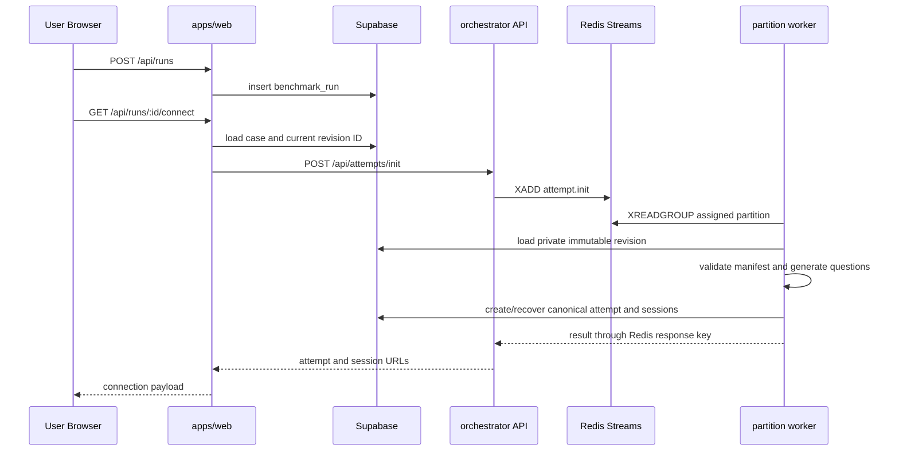
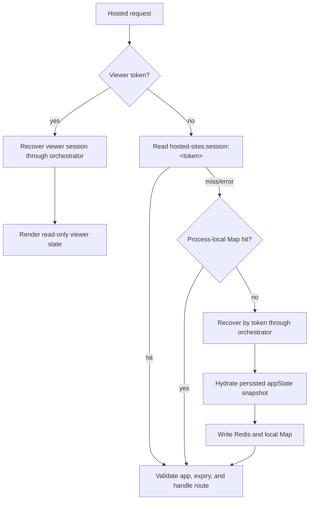
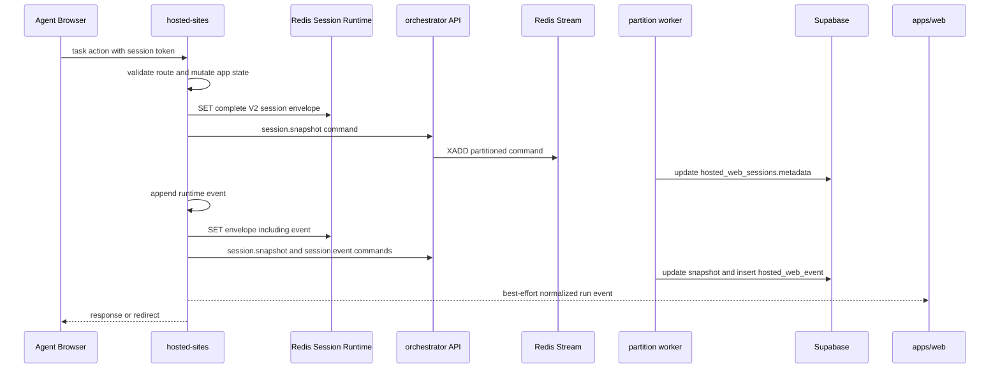
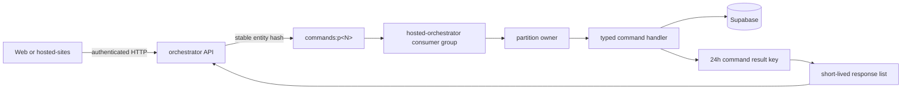
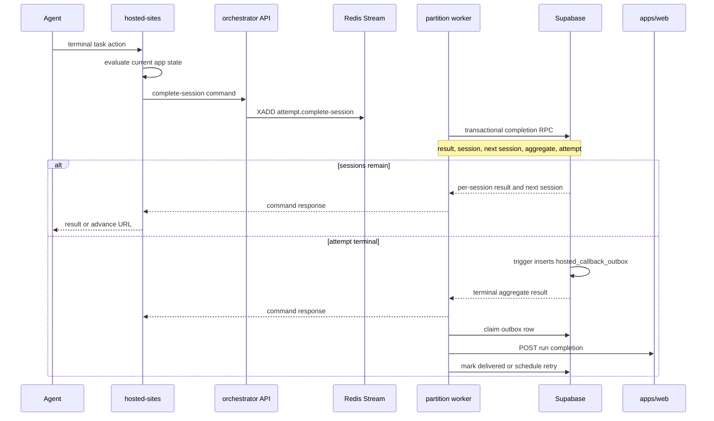

# Data Flow

This document describes the current runtime path. It does not treat planned Redis durability or session-concurrency work as an implemented guarantee. Static component ownership is in [Architecture](./architecture.md); authority and failure boundaries are in [Data Ownership](./data-ownership.md) and [Consistency and Failure](./consistency-and-failure.md).

## 1. Run Creation and Attempt Allocation

Web sends `runId`, `caseId`, and `caseRevisionId`, but never sends the private suite manifest. The worker loads the selected service-role-only revision, validates it, generates a deterministic question snapshot, and binds the attempt to that revision. The first session is `active`; later sessions are `created`.

Attempt initialization also uses a short Redis lease to reduce duplicate work. PostgreSQL uniqueness on `(run_id, case_id, provider)` remains the correctness boundary when Redis is unavailable or two requests race. See [Hosted Attempt Consistency](./attempt-consistency.md).

## 2. Hosted Request and Session Lookup

Write-session and viewer tokens follow different paths.

Nginx may send each request to any hosted-sites replica. Redis is the first shared lookup for write-session tokens; the local Map is a non-authoritative hot copy. Hosted-sites has no database credential. Its authenticated recovery request is resolved by the orchestrator from the latest successfully persisted `metadata.appState` snapshot, which may lag state that had existed only in Redis.

The current local-Map fallback can serve stale state after a Redis miss, and Redis session writes are not revision-checked. These are known horizontal-scaling gaps, not guarantees supplied by the diagram.

## 3. Task Mutation, Telemetry, and Snapshot Persistence

The current implementation persists a snapshot before many app events, then `recordEvent` persists the updated envelope and another snapshot before sending the event command. This is real write amplification, not an intentional exactly-once transaction. Commands are authenticated HTTP calls to the orchestrator API; hosted-sites does not write hosted lifecycle tables directly.

Access handling follows the same transport: hosted-sites updates counters in the runtime envelope and sends a `session.access` command. The worker updates the durable session access fields and appends a `hosted_web_access_logs` row.

The direct hosted-sites-to-Web event is best effort and feeds live run observability. Durable hosted telemetry is written separately by the orchestrator worker. There is no transaction joining those two paths.

## 4. Orchestrator Command Processing

The API process publishes and waits for a response. Two worker services currently own disjoint ranges `0-7` and `8-15`. Worker leases reject overlapping ownership, and readiness requires a lease for every partition. A failed handler is retried up to three times; terminal failures are persisted to `orchestrator_command_dead_letters` before the Stream entry is acknowledged.

Redis Streams currently survive process restart while the same Redis container data remains available, but production Compose does not yet provide a persistent Redis volume or HA. They are runtime transport, not the durable lifecycle source of truth.

## 5. Session Completion and Callback Outbox

`complete_hosted_attempt_session` locks the attempt and applies the terminal transition atomically inside PostgreSQL. Unique session-result and attempt-score constraints make retries first-writer-wins. Redis partition ordering reduces conflicts but is not the terminal lifecycle correctness boundary.

Web completion is not part of the terminal transaction. The database trigger creates one outbox row per attempt; workers attempt immediate delivery, while maintenance reconciles and retries pending rows. A failed Web callback therefore delays the Web read model without rolling back the hosted result.

## 6. Advance Resolution

`GET /api/attempts/:id/advance?session=...` reaches hosted-sites through the default Nginx route. Hosted-sites sends an authenticated `resolve-advance` request to the orchestrator. This read handler verifies the current session against durable attempt state and returns either:

- `complete: true` with no next URL, or
- the next session ID and tokenized start URL.

The client does not calculate suite ordering from URLs, Redis state, or its local history.

## 7. Expiry, Cleanup, and Recovery

When hosted-sites observes an expired write session, it evicts its runtime cache entry and sends an `attempt.timeout` command. A periodic orchestrator maintenance command also discovers expired durable sessions, atomically times out attempts, prunes old access logs, reconciles callback outbox rows, and retries delivery.

Recovery boundaries:

- process-local Map loss is expected and recoverable from Redis
- Redis session loss uses orchestrator recovery from the latest successful Supabase app-state snapshot
- Redis Stream loss can discard commands that had not produced durable database effects
- duplicate terminal commands recover from PostgreSQL constraints and transactional functions
- Web callback loss recovers through `hosted_callback_outbox`
- there is no distributed transaction spanning Redis, Supabase, hosted-sites, and Web

The exact current RPO, concurrency gaps, and degraded behavior are documented in [Consistency and Failure](./consistency-and-failure.md).
