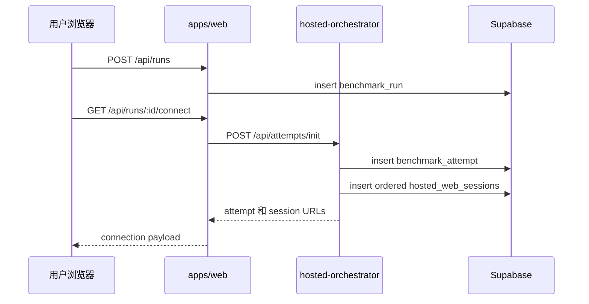
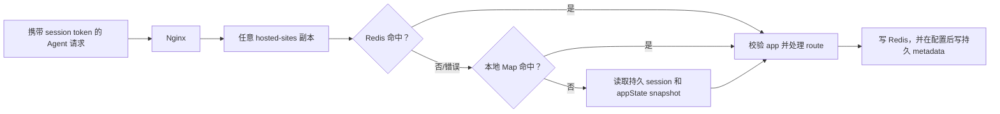
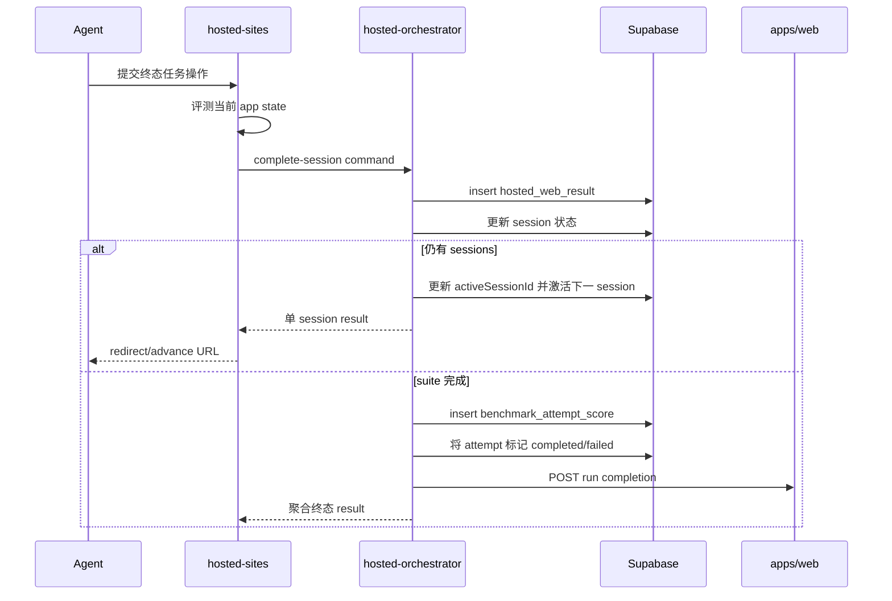

# 数据流

> [English](./data-flow.md) | 中文

## 1. 创建 Run 和分配 Attempt

第一个 session 为 `active`，后续 session 为 `created`。原始 token 返回给客户端，持久层只保存 token hash。

## 2. 多副本任务请求

共享 Redis 查询使横向扩容不需要 sticky session。

## 3. 任务修改和 Telemetry

1. Route 校验 token 的 `session.app` 与当前 app route 一致。
2. App action 只修改对应 app 的 `session.state`。
3. hosted-sites 将更新后的 V2 envelope 写入 Redis。
4. 如果 session 已持久化，hosted-sites 更新 `hosted_web_sessions.metadata.appState` 中的 app-specific snapshot。
5. hosted-sites 记录 hosted event，并向 `apps/web` 转发标准化 run event。
6. Web live page 在下一次 SSE snapshot 中得到 run、events 和 artifacts。

## 4. Session 完成和 Suite 推进

Required session 失败会使聚合 suite 失败。Optional evaluator 或 session 可提供 evidence，但是否阻止通过由 scoring 配置决定。

## 5. Advance 解析

`GET /api/attempts/:id/advance?session=...` 先到 hosted-sites，再调用 orchestrator 的 `resolve-advance` command。Orchestrator 校验当前 session 属于该 attempt，并返回：

- `complete: true`，没有 next URL；或
- 下一 session ID 和带 token 的 start URL。

客户端不会根据 URL 或本地状态自行计算顺序。

## 6. 过期和 Timeout

hosted-sites 发现 session 过期后，会标记 expired、清除缓存并发送 timeout command。Orchestrator 将 attempt 标记为 `timeout`，使剩余 active/created sessions 失效，并向 Web API 转发终态完成。

Orchestrator 的周期 sweep 也会查找过期 sessions，并按 retention 配置清理 access logs。

## 7. 恢复和一致性

- Redis 写失败会记录日志；当前请求中的进程对象可能继续工作，但跨副本连续性存在风险。
- Supabase snapshot 写失败不会立即破坏 Redis active session，但会降低恢复持久性。
- Completion 设计为幂等：重复终态 command 返回最近结果。
- Redis、Supabase、orchestrator 和 Web callback 之间没有分布式事务，因此更强可靠性需要 reconciliation 和 idempotency。
