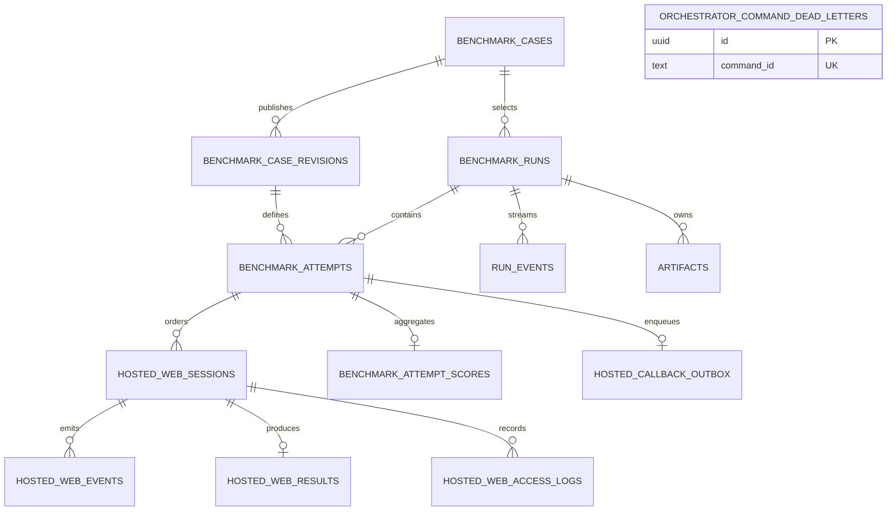
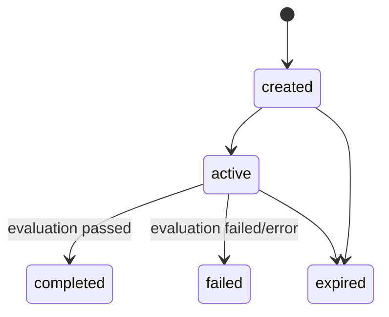
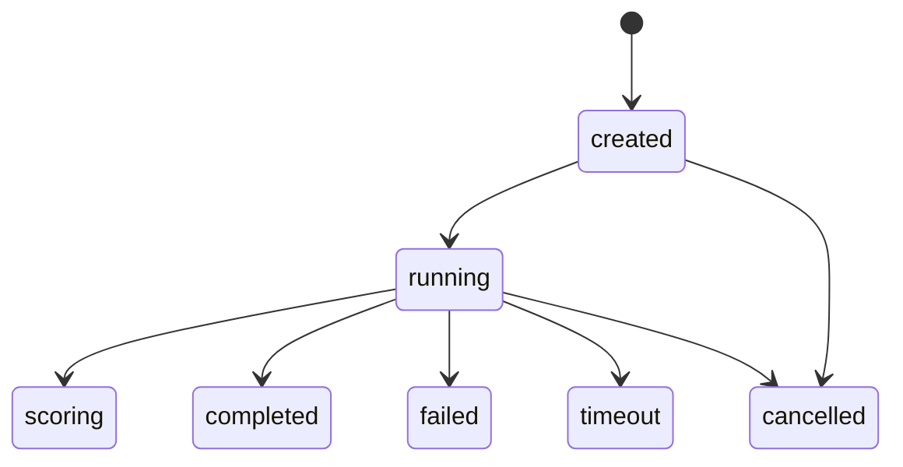

# Data Model

## Entity Relationships



## Durable Supabase Records

### `benchmark_cases` and `public_benchmark_cases`

`benchmark_cases` is the private control-plane definition of a benchmark case. Its `metadata` may contain suite manifests, variant pools, canonical answers, and evaluator parameters, so only service-role code can read the base table.

`public_benchmark_cases` is the anonymous/authenticated discovery boundary. It contains display fields plus a sanitized metadata projection with suite identity and ordered app/task summaries. It never contains question variants, generated task configuration, canonical answers, or evaluator parameters.

`benchmark_cases.current_revision_id` points to the release used for new attempts. `metadata` remains a service-role compatibility copy of that current manifest and is not the historical source of truth.

### `benchmark_case_revisions`

An immutable, service-role-only release record containing `revision`, SHA-256 `content_hash`, and the complete validated private `manifest`. Publication is atomic and idempotent through `publish_benchmark_case_revision`; normal updates and deletes are rejected. Historical attempts keep their revision foreign key when the case's current revision changes.

### `benchmark_runs`

The user-facing execution record. Important fields include owner (`user_id` or `guest_id`), `case_id`, `execution_mode`, lifecycle `status`, final `score`, timestamps, and error information.

Current hosted-web runs use `external-agent`. Some legacy enum values and columns remain in migrations for compatibility but are not active architecture components.

### `benchmark_attempts`

One execution of a hosted suite under a run.

- status: `created | running | scoring | completed | failed | cancelled | timeout`
- suite identity: `suite_slug`, `suite_version`
- immutable definition: `case_revision_id`
- `aggregate_score` and `scoring_summary`
- metadata control fields: `activeSessionId`, `activeSequenceIndex`, `completedSessionIds`

### `hosted_web_sessions`

One ordered task in an attempt.

- identity: `app`, `task_slug`, `task_version`, `seed_version`
- ordering: `sequence_index`
- scoring: `weight`, `required`
- lifecycle: `created | active | scoring | completed | failed | expired`
- routing: `start_url`
- authentication: `session_token_hash`; raw token is never persisted
- recovery metadata: suite fields, title, goal, start path, and app-specific state snapshot
- access metadata: count, first/last IP, user agent, access time, expiry

### `hosted_web_events`

Append-only task telemetry keyed by session, attempt, and run. `type`, optional `name`, and JSON `payload` support page loads, actions, and task signals.

### `hosted_web_results`

Per-session evaluation result:

- `status`: `passed | failed | error`
- normalized score from `0` to `1`
- summary, final state, evaluator evidence
- app/task/weight snapshot for auditability
- a unique `session_id` invariant; the first persisted terminal result wins concurrent retries

### `benchmark_attempt_scores`

Aggregate suite result with score, status, summary, and a JSON breakdown of all required and optional sessions.
Each attempt has at most one aggregate score. A concurrent writer recovers and uses the existing row.

### `hosted_web_access_logs`

Operational audit records for session access and expiry. These records have a retention sweep and should not be treated as permanent benchmark evidence.

### `hosted_callback_outbox`

One durable Web-completion handoff per terminal attempt. The database transition creates the row; orchestrator workers claim, deliver, retry, and eventually mark it `delivered` or `dead`. Callback failure does not roll back the hosted terminal result.

### `orchestrator_command_dead_letters`

Durable diagnostics for Redis commands that exhausted handler retries. It records the original command identity, Stream/message location, partition, payload type and payload, final error, attempt count, and replay state. It has no foreign key to a single domain entity because commands can be partitioned by attempt, session, or maintenance key.

## Redis Runtime Schema

Key:

```text
hosted-sites:session:<opaque-token>
```

Value:

```ts
type RedisHostedSessionEnvelopeV2 = {
  schemaVersion: 2;
  session: HostedSession;
};
```

If `session.expiresAt` is present, TTL is its remaining lifetime rounded up to seconds. Otherwise the cache uses `HOSTED_SESSION_REDIS_TTL_MS`. The current implementation does not take the minimum of both values.

The decoder accepts V2, V1 envelopes, and legacy raw JSON. Legacy flat app fields are migrated into `session.state` during read.

## Hosted Session Shape

Shared fields:

```ts
type HostedSessionBase = {
  id: string;
  token: string;
  accessMode?: "write" | "viewer";
  runId: string | null;
  caseId: string | null;
  attemptId: string | null;
  callbackSecret: string | null;
  app: HostedAppId;
  suiteSlug: string;
  suiteVersion: string;
  taskSlug: string;
  taskVersion: string;
  sequenceIndex: number;
  weight: number;
  required: boolean;
  title: string | null;
  goal: string;
  startPath: string | null;
  seedVersion: string;
  metadata: Record<string, unknown>;
  status: "created" | "active" | "completed" | "failed" | "expired";
  expiresAt: string | null;
  accessCount: number;
  lastAccessedAt: string | null;
  firstSeenIp: string | null;
  lastSeenIp: string | null;
  firstSeenUserAgent: string | null;
  lastSeenUserAgent: string | null;
  createdAt: string;
  events: Array<Record<string, unknown>>;
  persisted: boolean;
  state: AppSpecificState;
};
```

App-specific state is a discriminated union:

| App | State fields |
| --- | --- |
| `shopping-lite` | `products`, `cart`, `orders` |
| `wiki-lite` | `wikiArticles`, `wikiAnswerSubmissions` |
| `forum-lite` | `threads`, `moderationActions` |
| `repo-lite` | `files`, `issues`, `mergeRequests` |

A session never carries another app's state fields. Redis validation rejects mismatched app/state payloads.

The Redis envelope currently contains the raw write token, generated private task configuration inside `metadata`, and may contain a callback secret. Redis must therefore remain private. Token hashing, credential minimization, and ACL separation are tracked in [Issue #62](https://github.com/Kaiwen0418/agent-benchmark/issues/62).

## State Machines





## Source-of-Truth Rules

- Redis is authoritative for the latest available mutable task state during an active session, but current whole-envelope writes are not concurrency-safe.
- Supabase is authoritative for durable lifecycle, audit, and scoring records.
- `benchmark_case_revisions` is authoritative for the suite manifest used by an attempt; its generated question snapshot remains in attempt/session metadata.
- The orchestrator is the only application writer for attempts, hosted sessions, and hosted results; hosted-sites may read session rows only for cache recovery.
- The process-local Map is not authoritative and may be lost at any time.
- `metadata.appState` is a recovery snapshot, not a separately writable domain model.
- Attempt progression is determined by orchestrator metadata plus persisted session/result rows.
- Session cache keys and ingest records are separate. Durable commands use partitioned `agentbench:orchestrator:commands:p<N>` Streams, consumer group `hosted-orchestrator`, 24-hour command result keys, short-lived response lists, and partition lease keys.

See [Data Ownership](./data-ownership.md) for the complete reader/writer matrix and [Consistency and Failure](./consistency-and-failure.md) for implemented guarantees.
