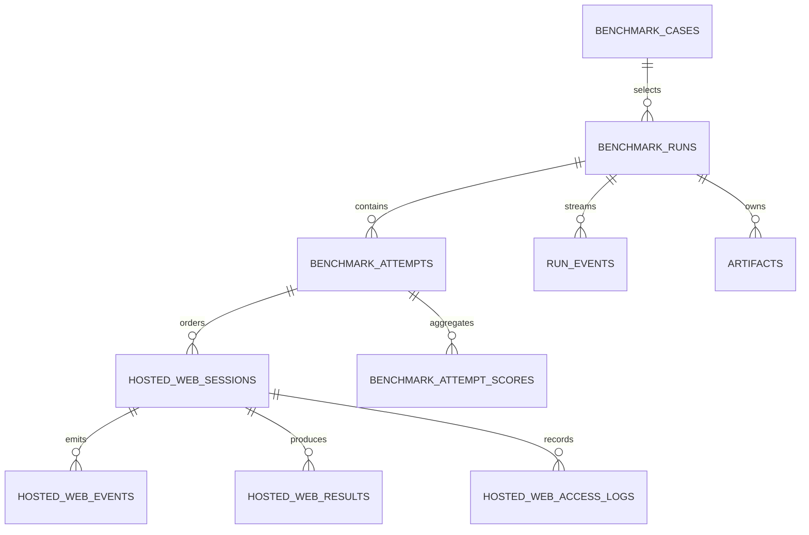
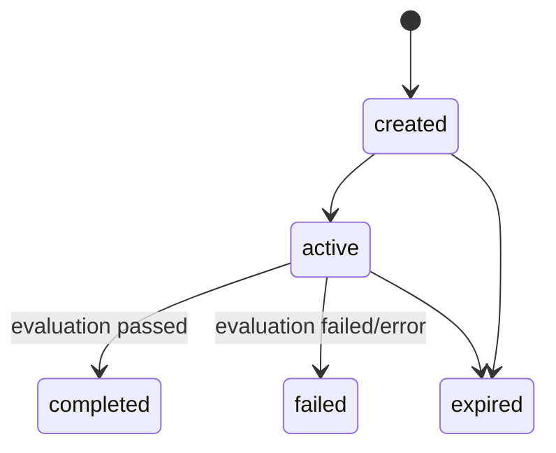
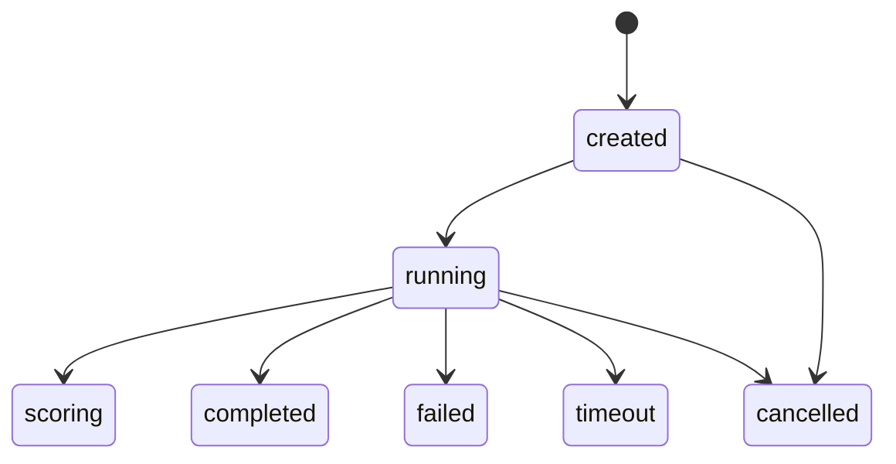

# 数据模型

> [English](./data-model.md) | 中文

## 实体关系



## Supabase 持久记录

### `benchmark_runs`

面向用户的执行记录。关键字段包括 owner（`user_id` 或 `guest_id`）、`case_id`、`execution_mode`、生命周期 `status`、最终 `score`、时间戳和错误信息。

当前 hosted-web run 使用 `external-agent`。migration 中仍保留部分历史 enum 和 column 用于兼容，但它们不代表当前架构组件。

### `benchmark_attempts`

Run 下的一次 hosted suite 执行。

- 状态：`created | running | scoring | completed | failed | cancelled | timeout`
- suite 标识：`suite_slug`、`suite_version`
- `aggregate_score` 和 `scoring_summary`
- metadata 控制字段：`activeSessionId`、`activeSequenceIndex`、`completedSessionIds`

### `hosted_web_sessions`

Attempt 中的一个有序任务。

- 标识：`app`、`task_slug`、`task_version`、`seed_version`
- 顺序：`sequence_index`
- 评分：`weight`、`required`
- 生命周期：`created | active | scoring | completed | failed | expired`
- 路由：`start_url`
- 鉴权：`session_token_hash`，原始 token 不持久化
- 恢复 metadata：suite 字段、title、goal、start path 和 app-specific state snapshot
- 访问 metadata：次数、首末 IP、user agent、访问时间和过期时间

### `hosted_web_events`

按 session、attempt 和 run 关联的 append-only task telemetry。`type`、可选 `name` 和 JSON `payload` 用于 page load、action 和 task signal。

### `hosted_web_results`

单 session 评分结果：

- `status`：`passed | failed | error`
- `0` 到 `1` 的标准化 score
- summary、final state 和 evaluator evidence
- 用于审计的 app/task/weight snapshot

### `benchmark_attempt_scores`

套件聚合结果，包含 score、status、summary 和所有 required/optional sessions 的 JSON breakdown。

### `hosted_web_access_logs`

记录 session 访问和过期的运维审计数据。该表有 retention sweep，不应作为永久 benchmark evidence。

## Redis 运行时 Schema

Key：

```text
hosted-sites:session:<opaque-token>
```

Value：

```ts
type RedisHostedSessionEnvelopeV2 = {
  schemaVersion: 2;
  session: HostedSession;
};
```

TTL 根据 `session.expiresAt` 或 `HOSTED_SESSION_REDIS_TTL_MS` 计算，并向上取整为秒。

Decoder 支持 V2、V1 envelope 和旧裸 JSON。旧扁平 app 字段会在读取时迁移到 `session.state`。

## Hosted Session 结构

共享字段：

```ts
type HostedSessionBase = {
  id: string;
  token: string;
  runId: string | null;
  caseId: string | null;
  attemptId: string | null;
  app: HostedAppId;
  suiteSlug: string;
  suiteVersion: string;
  taskSlug: string;
  taskVersion: string;
  sequenceIndex: number;
  weight: number;
  required: boolean;
  title: string | null;
  goal: string;
  startPath: string | null;
  seedVersion: string;
  metadata: Record<string, unknown>;
  status: "created" | "active" | "completed" | "failed" | "expired";
  events: Array<Record<string, unknown>>;
  state: AppSpecificState;
};
```

App-specific state 是判别联合：

| App | State 字段 |
| --- | --- |
| `shopping-lite` | `products`、`cart`、`orders` |
| `wiki-lite` | `wikiArticles`、`wikiAnswerSubmissions` |
| `forum-lite` | `threads`、`moderationActions` |
| `repo-lite` | `files`、`issues`、`mergeRequests` |

一个 session 不会携带其他 app 的 state 字段。Redis validator 会拒绝 app/state 不匹配的 payload。

## 状态机





## Source of Truth 规则

- Active session 的可变任务状态以 Redis 为准。
- 持久生命周期、审计和评分记录以 Supabase 为准。
- 进程内 Map 不是权威数据，可随时丢失。
- `metadata.appState` 是恢复 snapshot，不是独立可写 domain model。
- Attempt 推进由 orchestrator metadata 与持久化 session/result rows 共同决定。
