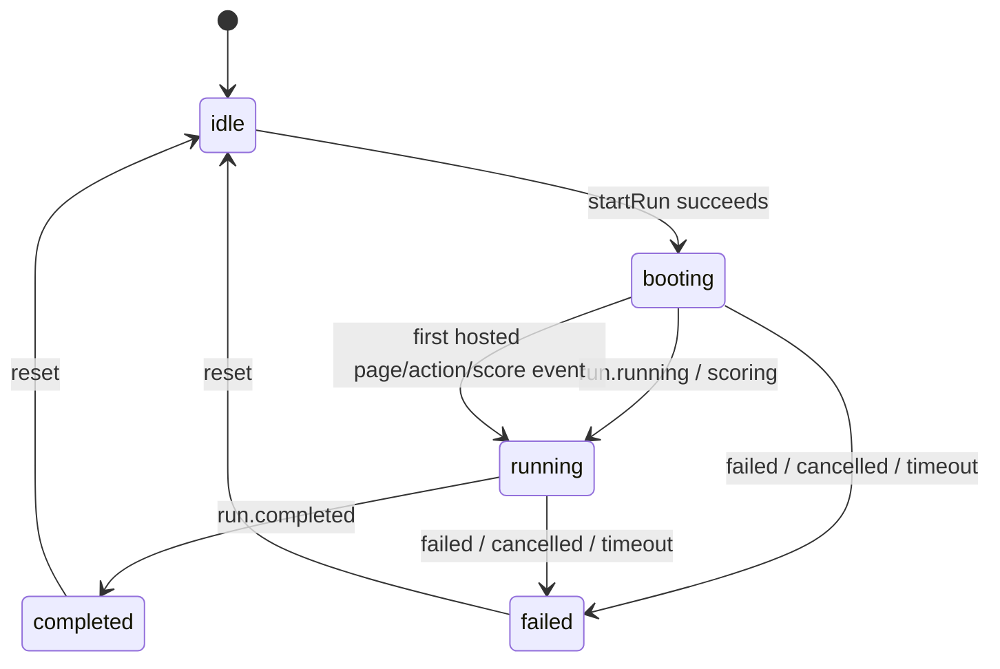

# Frontend Runtime State Machine

The landing-page playground is the only user-facing hosted-web run interface. The Mac-style viewer is embedded there; `/runs/<run-id>/live?embed=1` is an internal rendering endpoint, not a standalone page or navigation target.

## Top-Level States

| State | Source | Primary UI | Allowed actions |
| --- | --- | --- | --- |
| `idle` | Initial state or reset | Benchmark selector | Create run |
| `booting` | `queued`, `waiting_for_agent`, `agent_connected`, `starting` | Connection guide, waiting events, viewer boot state | Stop run, open connection page |
| `running` | Run is `running/scoring`, or hosted activity appears during boot | Active suite session, aggregate score, events, viewer | Stop run, complete active session |
| `completed` | Run status is `completed` | Final score breakdown | Start again |
| `failed` | `failed`, `cancelled`, `timeout` | Error summary and available score breakdown | Start again |

State mapping belongs in `apps/web/lib/playground-store.ts` through `mapRunStatus` and `applyRunSnapshot`. Components must not invent run states from local UI events.

## Transitions

## Derived Views

- Collapse connection instructions after the hosted connection page is opened or the run becomes active.
- Show only the active session while a run is in progress.
- "Current Suite & Score" combines suite progress, weighted aggregate score, and completed evaluators.
- Hide connection and active-suite content after termination; show the final breakdown instead.
- Use a single dark event-stream surface. Lime indicates connected/polling; gray indicates not connected.
- Scale the viewer's fixed design canvas rather than independently reflowing hosted app content on small screens.

## Data Priority

1. Terminal status and final score from the run API.
2. `hosted.score` events for the current attempt and their session weights.
3. Generic `score.updated` events.
4. Show `--` when no valid score exists; never present one evaluator score as the suite score.

All hosted scores are isolated by `attemptId`. Events from old or superseded attempts must not affect the current aggregate.
