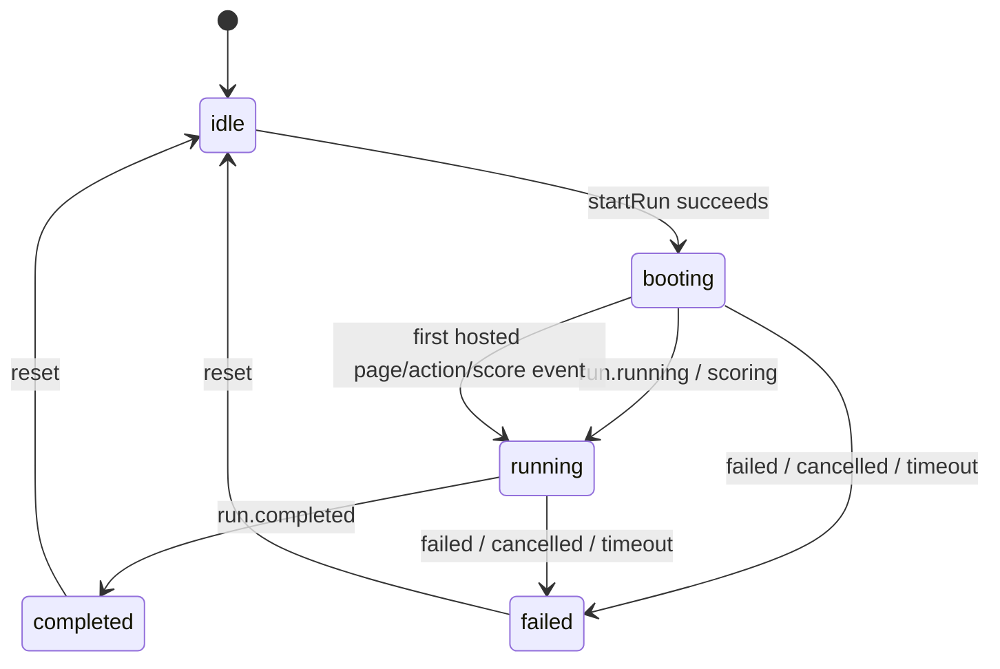

# 前端运行状态机

首页 playground 是 hosted-web run 的唯一用户界面。右侧 Mac viewer 只在首页内嵌展示；`/runs/<run-id>/live?embed=1` 是内部渲染端点，不提供独立用户页面或入口按钮。

## 顶层状态

| 状态 | 来源 | 主要界面 | 允许操作 |
| --- | --- | --- | --- |
| `idle` | 初始状态或用户 reset | benchmark 选择器 | 创建 run |
| `booting` | `queued`、`waiting_for_agent`、`agent_connected`、`starting` | connection guide、等待事件、viewer boot 状态 | 停止 run、访问 connection page |
| `running` | run 为 `running/scoring`，或 booting 阶段已出现 hosted activity | 当前 suite、累计 score、event stream、内嵌 viewer | 停止 run、完成当前 session |
| `completed` | run status 为 `completed` | 最终 score breakdown | Start Again |
| `failed` | `failed`、`cancelled`、`timeout` | 错误摘要和已有 score breakdown | Start Again |

状态映射集中在 `apps/web/lib/playground-store.ts` 的 `mapRunStatus` 和 `applyRunSnapshot`。组件不得根据局部 UI 事件自行发明新的 run 状态。

## 状态转换

## 派生视图

- Connection instruction 在 hosted connection page 被访问或 run 开始活动后折叠。
- 运行中只显示当前 active session；其他 session 不占据主信息区。
- “Current Suite & Score” 同时显示 suite 进度、累计加权分和已完成 evaluator。
- run 结束后隐藏 suite/connection 内容，只显示最终 score breakdown。
- Event stream 使用统一深色容器；连接状态仅使用 lime 表示已连接/轮询，灰色表示尚未连接。
- viewer iframe 使用固定设计画布整体等比例缩放，不为小屏单独重排 hosted app 内容。

## 数据优先级

1. run API 的 terminal status 和最终 score。
2. 当前 attempt 的 `hosted.score` 事件和 session 权重。
3. 普通 `score.updated` 事件。
4. 无有效 score 时显示 `--`，不得用单个 evaluator 分数冒充 suite 总分。

所有 hosted score 必须按 `attemptId` 隔离；旧 attempt 或重复事件不能进入当前累计分。
