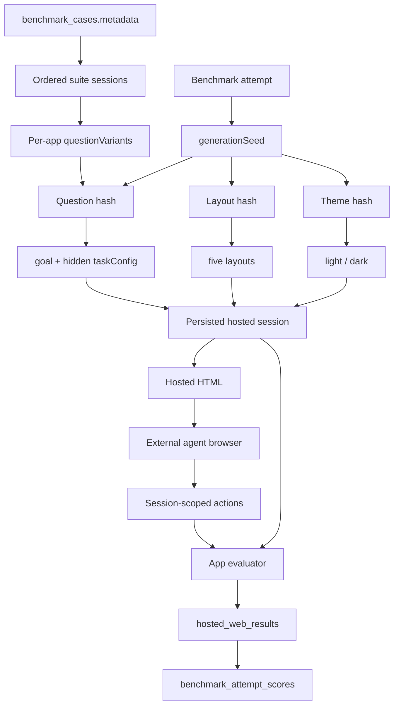

# Hosted-Site App Authoring And Scoring

This is the implementation contract for hosted-web apps, question variants, and scorers. The goal is not to clone WebArena's heavyweight services. AgentBench preserves cross-page task structure and verifiable outcomes through small, deterministic hosted apps.

Understand the **case, generation, session, and scoring** contracts before writing HTML.

## Design Model

| Object | Owns | Must not own |
| --- | --- | --- |
| Benchmark case | Suite, order, weights, variant pools | App business logic |
| Question variant | Public `goal` paired with hidden `taskConfig` | URL or action contract changes |
| UI presentation | Layout and light/dark theme | Answers or scoring semantics |
| Hosted session | One task, presentation, and mutable app state | Cross-session state |
| App definition | Seed, actions, routes, render, evaluate | Attempt lifecycle |
| Orchestrator | Generation, sessions, advancement, aggregation | App-specific business branches |

Fixed questions become memorization tests. AgentBench does not generate questions with an online LLM. It deterministically selects from versioned variant pools using an attempt seed and independently selects presentation.



## Current Hosted Testcases

The production `shopping-constrained-checkout` case runs `hosted-web-suite-v1` version `v2`. All four sessions are required and have weight 1.

| App | Variants |
| --- | --- |
| `shopping-lite` | `budget-charger-standard`, `cable-express`, `travel-case-standard` |
| `forum-lite` | `battery-recall`, `wifi-reset`, `screen-advisory` |
| `repo-lite` | `pnpm-install`, `yarn-install`, `bun-install` |
| `wiki-lite` | `release-date`, `dispatch-window`, `charger-price` |

Each app has three semantic variants and ten presentation combinations (`5 layouts x 2 themes`). Presentation must never affect actions or scoring. See [Benchmark Scoring And Testing](./benchmark-testing.md) for required matrix coverage.

## Core Rules

- **Deterministic:** the same generation seed and task version produce the same session.
- **Session-scoped:** mutable state never leaks across sessions.
- **Server-scored:** prefer server-owned business state over browser traces.
- **Small surface:** implement only pages and transitions required by the task.
- **Stable contract:** URLs, field names, actions, and confirmations remain stable across presentations.
- **External browser:** the evaluated agent owns its browser; hosted-sites does not run one.
- **Generic persistence:** app state uses session snapshots and generic result/evidence tables, not per-app tables.

WebArena domains may inspire tasks, but these apps are `hosted-web` or `webarena-lite`, not canonical WebArena. Implement the task surface, not Magento, GitLab, Postmill, Kiwix, or OpenStreetMap in full.

## Service Boundaries

- `apps/hosted-sites`: app pages, mutations, telemetry, app evaluation, final evidence.
- `apps/hosted-orchestrator`: attempt initialization, ordered advancement, aggregation, timeout, cleanup.
- `apps/web`: run creation, connection payload, progress, live view, public result.

Question pools belong in `benchmark_cases.metadata.sessions[].metadata.questionVariants`. Generic selection belongs in the orchestrator. Apps must not call random generators at runtime.

## Generation Contract

```json
{
  "metadata": {
    "questionVariants": [
      {
        "id": "shipping-window",
        "goal": "Find the dispatch window and submit only the duration without surrounding words.",
        "taskConfig": {
          "targetArticleSlug": "shipping-policy",
          "answerContract": {
            "kind": "duration",
            "canonicalValue": "two business days",
            "normalization": "trim-casefold",
            "sourceArticleSlug": "shipping-policy"
          }
        }
      }
    ]
  }
}
```

After selection, the orchestrator removes the pool and persists only the selected metadata:

```json
{
  "questionGeneration": {
    "schemaVersion": 2,
    "generationSeed": "opaque-attempt-seed",
    "variantId": "shipping-window",
    "uiVariant": "dashboard",
    "uiTheme": "dark",
    "taskConfig": {
      "targetArticleSlug": "shipping-policy",
      "answerContract": {
        "kind": "duration",
        "canonicalValue": "two business days",
        "normalization": "trim-casefold",
        "sourceArticleSlug": "shipping-policy"
      }
    }
  }
}
```

Variant IDs are stable and unique. Goals expose required constraints without answers. `taskConfig` is privileged scorer data and must not appear in HTML, connection payloads, or telemetry. Evaluators use `readTaskConfig()` and fail closed when configuration is missing. Semantic changes require a seed or suite version update.

## App Structure

```text
apps/hosted-sites/src/apps/<app-slug>/
  definition.ts
  types.ts
  seed.ts
  actions.ts
  render.ts
  evaluate.ts
  final-state.ts

apps/hosted-sites/src/routes/<route-name>.ts
```

- `types.ts`: compact app domain types.
- `seed.ts`: deterministic fixtures and defaults.
- `actions.ts`: pure business mutations with explicit inputs.
- `render.ts`: HTML for the required task surface.
- `evaluate.ts`: evaluator-level `HostedWebScoreResult`.
- `final-state.ts`: compact, redacted result evidence.
- `definition.ts`: composes app hooks.
- `routes`: HTTP parsing, persistence, telemetry, rendering.
- `runtime/app-registry.ts`: the only top-level app registration point.

Do not add app branches to `server.ts` or a central evaluation dispatcher.

## Scoring

Scoring uses WebArena-Verified-style evaluator families with strict aggregation:

- `backend_state`: primary proof for checkout, posting, settings, file edits, and created records.
- `retrieve_value`: deterministic information retrieval against hidden canonical values.
- `ui_state`: auxiliary proof based on stable server-owned view markers.
- `final_response`: structured final text; optional unless the task is purely informational.

All required evaluators must pass for session score 1. Any required failure produces score 0; evaluator errors produce status `error`. Optional evaluators are diagnostic only.

Validate final business state, not click paths. Keep evidence compact and explainable. Do not use telemetry, CSS classes, animation state, or full DOM traces as the primary success condition.

## Routes, Actions, And Persistence

Routes validate tokens, parse HTTP input, call actions, persist snapshots, emit necessary telemetry, and render or redirect. Actions do not know about HTTP, databases, HTML, or the orchestrator.

Use generic persistence:

- `hosted_web_sessions`: lifecycle, metadata, app snapshot.
- `hosted_web_events`: lightweight debugging and UI events.
- `hosted_web_results`: terminal score, evaluators, final state.
- `benchmark_attempt_scores`: suite aggregate.

Do not create one business-table set per app.

## Implementation Order

1. Define compact domain types.
2. Add deterministic fixtures.
3. Implement pure actions.
4. Render only required pages.
5. Evaluate hidden `taskConfig`, preferring backend state.
6. Produce compact final evidence.
7. Add HTTP routes.
8. Compose `definition.ts` and register it.
9. Add positive, negative, route, and terminal-state tests.
10. Run builds and lifecycle smoke.

## Verification

```bash
pnpm --filter hosted-sites test
pnpm --filter hosted-sites build
pnpm --filter hosted-orchestrator build
bash apps/hosted-sites/scripts/orchestrator-smoke.sh
```

Apps entering the default suite also run:

```bash
HOSTED_SITES_PORT=4011 HOSTED_ORCHESTRATOR_PORT=5011 \
  bash apps/hosted-sites/scripts/orchestrator-smoke-full-pass.sh
```

Acceptance requires registered typed state, evaluator breakdowns, at least one required `backend_state` unless purely informational, redacted final evidence, no app-specific tables, no server browser, and successful initialization/operation/scoring as an orchestrated session.
