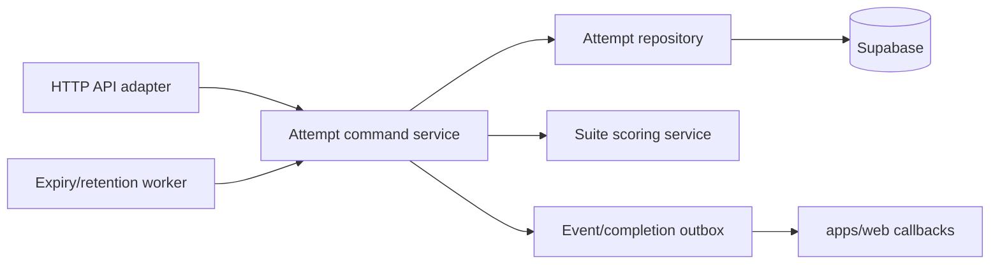

# Orchestrator Responsibilities TODO

> [中文](./orchestrator-todo.zh-CN.md) | English

## Current Responsibilities

The orchestrator currently combines HTTP transport, authentication, attempt creation, session persistence, lifecycle commands, score aggregation, timeout handling, cleanup sweeps, and Web callbacks in one service and largely one server module. It is now the sole writer for `benchmark_attempts`, `hosted_web_sessions`, and `hosted_web_results`; hosted-sites sends authenticated persistence commands and keeps Redis as runtime cache.

This is acceptable for the current scale, but it makes ownership and failure recovery harder to reason about.

## Target Boundary

The orchestrator should remain one deployable service until scale requires otherwise, but internal modules should follow these boundaries.

## Evolution Sequence

1. **Complete:** hosted-sites has no direct database write path and retains read-only recovery temporarily.
2. **Complete:** orchestrator owns attempt, session, result, event, and access-log writes.
3. **Complete:** Redis session keys remain the shared runtime cache for hosted-sites scaling.
4. **Complete:** a separate Redis Stream and consumer group are the ingest backbone for orchestrator writes.

The backbone now has separate API/worker modes, stable attempt/session partitioning, disjoint worker assignments, and Redis partition leases. The default deployment runs two workers across 16 partitions. Remaining work is dead-letter handling, lag metrics, explicit retry policy, and database compare-and-set as defense in depth.

## P0: Correctness

- Add database-level compare-and-set or transactions for active-session transitions.
- Make `complete-session`, `timeout`, and attempt initialization idempotent with explicit command IDs.
- Add unique constraints preventing duplicate terminal results and aggregate scores.
- Add reconciliation for attempts whose session result is persisted but Web completion callback failed.
- Define exact retry behavior for Supabase and Web callback failures.

## P1: Separation of Concerns

- Split `server.ts` into transport, auth, repository, initialization, lifecycle, scoring, callback, and cleanup modules.
- Move default app goals/start paths to shared hosted app definitions rather than duplicating them in orchestrator.
- Replace loosely typed request parsing with shared Zod schemas.
- Rename `RUNNER_SHARED_SECRET`, `x-runner-secret`, and `isInternalRunnerRequest` to hosted-service terminology with a compatibility window.
- Introduce structured error codes rather than returning raw exception messages.

## P1: Observability

- Add request IDs, attempt IDs, and command IDs to structured logs.
- Export metrics for init latency, completion latency, active attempts, timeout count, duplicate commands, reconciliation backlog, and cleanup duration.
- Add health/readiness checks for Supabase connectivity, not only process liveness.
- Record callback delivery status and retry count.

## P2: Throughput and Scaling

- Replace full result/session reloads during every completion with a transaction or maintained attempt projection.
- Move cleanup scheduling out of API replicas into a dedicated scheduler; the current time-bucket command ID prevents duplicate execution.
- Add dead-letter handling and poison-message inspection for commands that repeatedly fail.
- Export stream lag, pending-entry count, reclaim count, processing latency, and timeout metrics.
- Load-test concurrent completion of the same attempt and multiple attempts sharing one run.

## P2: API Evolution

- Version internal routes under `/api/v1`.
- Add explicit read-model versioning for attempt state.
- Return ETags or revision numbers so clients can detect stale state.
- Document deprecation periods and compatibility rules for session envelope and command schemas.

## Completion Criteria

The orchestrator boundary is considered mature when:

- all commands are idempotent and concurrency-safe
- no correctness-critical state exists only in process memory
- periodic jobs execute once per interval across replicas
- failed callbacks are automatically retried and observable
- API schemas are shared, versioned, and validated
- lifecycle transitions have integration tests against a real Postgres instance
