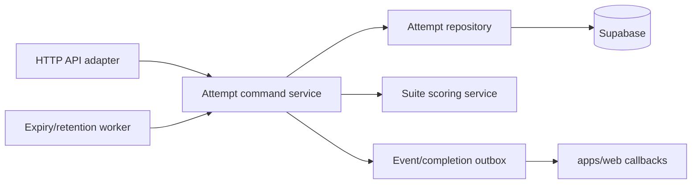

# Orchestrator 职责优化 TODO

> [English](./orchestrator-todo.md) | 中文

## 当前职责

Orchestrator 当前在一个服务、主要一个 `server.ts` 中同时承担 HTTP transport、鉴权、attempt 创建、session 持久化、生命周期 command、评分聚合、timeout、cleanup sweep 和 Web callback。

当前规模下可以运行，但职责边界和故障恢复较难推理。

## 目标边界

在规模真正需要前，orchestrator 可以继续作为一个部署单元，但内部模块应遵守上述边界。

## P0：正确性

- 为 active-session transition 增加数据库 compare-and-set 或 transaction。
- 使用明确 command ID，使 `complete-session`、`timeout` 和 attempt 初始化幂等。
- 增加 unique constraint，防止重复 terminal result 和 aggregate score。
- Completion command 直接持久化 final state，移除进程内 `pendingFinalStates` Map。
- 对“session result 已持久化但 Web completion callback 失败”的 attempt 增加 reconciliation。
- 明确定义 Supabase 和 Web callback 失败后的 retry 行为。

## P1：职责拆分

- 将 `server.ts` 拆为 transport、auth、repository、initialization、lifecycle、scoring、callback 和 cleanup 模块。
- 将默认 app goal/start path 移入共享 hosted app definitions，避免 orchestrator 重复维护。
- 使用共享 Zod schema 替代宽松的手工 request parsing。
- 将 `RUNNER_SHARED_SECRET`、`x-runner-secret` 和 `isInternalRunnerRequest` 改为 hosted-service 命名，并保留兼容窗口。
- 引入结构化 error code，不直接返回异常文本。

## P1：可观测性

- 在结构化日志中加入 request ID、attempt ID 和 command ID。
- 导出 init latency、completion latency、active attempts、timeout count、duplicate commands、reconciliation backlog 和 cleanup duration 指标。
- Health/readiness 除进程存活外，还应检测 Supabase 连接。
- 记录 callback delivery 状态和 retry count。

## P2：吞吐和扩容

- Completion 时不再全量读取 result/session rows，改用 transaction 或持续维护的 attempt projection。
- 将 cleanup 和 reconciliation 作为独立 worker mode，避免每个 orchestrator 副本执行相同 sweep。
- 周期任务执行前增加 leader election 或数据库 advisory lock。
- 只有 callback 量或异步 evaluator 成本证明有必要时才引入 queue。
- 对同一 attempt 并发 completion、同一 run 多 attempts 进行负载测试。

## P2：API 演进

- 内部 route 使用 `/api/v1` 版本前缀。
- 为 attempt state read model 增加明确版本。
- 返回 ETag 或 revision number，使客户端可检测 stale state。
- 记录 session envelope 和 command schema 的弃用周期及兼容规则。

## 完成标准

满足以下条件时，orchestrator 边界可视为成熟：

- 所有 command 幂等且并发安全
- correctness-critical state 不只存在于进程内存
- 多副本下周期任务每个 interval 只执行一次
- callback 失败能够自动重试且可观测
- API schema 共享、版本化并经过验证
- lifecycle transition 有基于真实 Postgres 的集成测试
