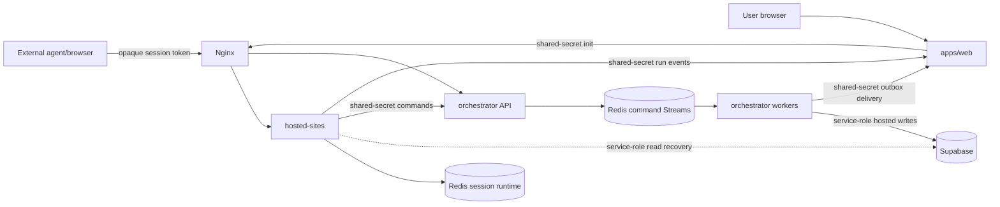

# Security

## Trust Boundaries

The external agent and its browser are untrusted. AgentBench exposes only benchmark task pages and opaque session URLs; it does not grant host, Docker, filesystem, Supabase, or Redis access to the agent.

## Controls

- Store only SHA-256 session-token hashes in Supabase.
- Keep raw tokens in URLs/Redis only for their active lifetime.
- Require the shared service secret for internal Web and orchestrator writes.
- Keep Supabase service-role keys server-side.
- Browser components must use same-origin Web APIs and must not import Supabase clients or browser-facing Supabase environment variables.
- Use RLS for user-owned read paths.
- Validate app/state shape when decoding Redis payloads.
- Reject a session token on routes for another app.
- Use no-store headers on session and control-plane responses.
- Restrict artifact file paths to the owning run directory.

## Data Handling

- Telemetry must avoid secrets and unnecessary form values.
- IP and user-agent access logs require retention limits.
- Final-state evidence should contain only data needed to explain scoring.
- Redis should not be publicly reachable.
- Nginx should expose only intended hosted and orchestrator routes.

## Current Risks

- Session tokens in URLs may appear in browser history, proxy logs, and referrers.
- Internal auth uses a single shared secret and a legacy header name.
- Redis and Supabase updates are not one distributed transaction.
- Session Redis currently stores raw bearer tokens, private task configuration, and callback material.
- Redis currently has no per-service ACL boundary; all hosted services share the private Compose network.
- Dead callback rows require operational alerting and manual inspection.
- Rate limiting is not yet documented as a gateway-enforced control.

## Required Hardening

- redact session query parameters from access logs
- rotate and version service credentials
- add gateway rate limits and request-size limits
- alert on callback outbox backlog and dead rows
- use command idempotency keys
- audit RLS and service-role usage before public launch
- define incident response for leaked session tokens
- hash Redis session-token key suffixes and remove reusable callback credentials from session envelopes
- introduce per-service Redis ACL identities and command/key restrictions
