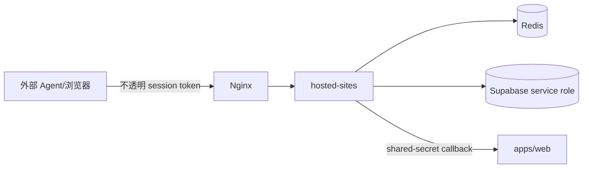

# 安全

> [English](./security.md) | 中文

## 信任边界

外部 Agent 及其浏览器不可信。AgentBench 只暴露基准任务页面和不透明 session URL，不向 Agent 提供宿主机、Docker、文件系统、Supabase 或 Redis 权限。

## 控制措施

- Supabase 只保存 session token 的 SHA-256 hash。
- 原始 token 仅在 active 生命周期内存在于 URL/Redis。
- Web 内部写入和 orchestrator command 要求 shared service secret。
- Supabase service-role key 只保留在服务端。
- 用户数据读取使用 RLS。
- 解码 Redis payload 时校验 app/state 结构。
- 在其他 app route 上拒绝不匹配的 session token。
- Session 和控制面响应使用 no-store header。
- Artifact 文件路径限制在所属 run 目录内。

## 数据处理

- Telemetry 不应包含 secret 和不必要的表单值。
- IP 和 user-agent access log 必须设置 retention。
- Final-state evidence 只保留解释评分所需的数据。
- Redis 不应暴露到公网。
- Nginx 只暴露预期的 hosted 和 orchestrator routes。

## 当前风险

- URL 中的 session token 可能进入浏览器历史、代理日志和 referrer。
- 内部鉴权使用单一 shared secret，并保留历史 header 名称。
- Redis 与 Supabase 更新不在一个分布式事务中。
- Dead callback 记录仍需要运维告警和人工检查。
- Gateway rate limiting 尚未形成明确控制规范。

## 必要加固

- 从 access log 中脱敏 session query parameter
- 轮换并版本化 service credential
- 增加 gateway rate limit 和 request-size limit
- 为 callback outbox backlog 和 dead 记录增加告警
- 使用 command idempotency key
- 公网发布前审计 RLS 和 service-role 使用
- 为 session token 泄漏定义 incident response
